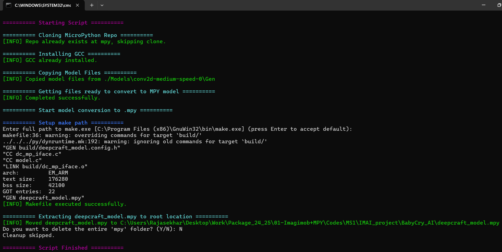

# DEEPCRAFT™ MicroPython Converter

This utility automates the conversion of DEEPCRAFT™ Studio model exports into .mpy modules compatible with MicroPython projects. It simplifies integration of AI/ML models into MicroPython applications running on platforms like Infineon’s PSoC™ 6.

# Requirements

1. Python 3.12.0 +

2. A compatible DEEPCRAFT™ model (C source files and headers) generated from DEEPCRAFT™ studio

3. [GnuWin32 Make](https://sourceforge.net/projects/gnuwin32/)

# Usage

The script is pip installable by:

    pip install git+https://github.com/Infineon/deepcraft-micropython-converter.git

Install the requirements:

    pip install -r requirements.txt

*Note: Ensure to install the script in the root directory of your DEEPCRAFT™ project.*

# Integration with DEEPCRAFT™ 

1) You can set up the converter as an external tool in DEEPCRAFT™ Studio:

    1. Go to Tools > Options > External Tools

    2. Add a new row with the following:

        - `File Filter`: *.py

        - `Menu Path`: Run Script

        - `Console`: Cmd (keep)

        - `Confirm dialog`: ✅ Checked

        - `Command`: python "path/to/deepcraft_micropython_converter.py"

2) After generating the model and preparing for deployment, right-click the script and select `Run Script` to launch the utility. Follow the terminal instructions. On success, you’ll see the output:

3) This generates `deepcraft_model.mpy` at the project root, ready to be copied to your edge device’s filesystem. Use any micropython supported IDE's to drop the file into your device and then use it like any other module:

    import deepcraft_model

# Supported API's

Below is a list of supported APIs exposed by the compiled `.mpy` module. Use these functions to interact with your model instance for initialization, data input, and inference.

| Function                  | Description                                           | Input Arguments                                           | Return                                  | Sample Usage                                     |
|---------------------------|-------------------------------------------------------|------------------------------------------------------------|------------------------------------------|--------------------------------------------------|
| `DEEPCRAFT()`             | Creates an instance for your model                    | None                                                       | `deepcraft` object                       | `import deepcraft_model as m` `model = m.DEEPCRAFT()` |
| `init()`                  | Initializes the model                                 | None                                                       | None                                     | `model.init()`                                   |
| `get_model_input_dim()`   | Returns expected number of sensor values per inference| None                                                       | `int`                                    | `model.get_model_input_dim()`                    |
| `get_model_output_dim()`  | Returns number of output classes                      | None                                                       | `int`                                    | `model.get_model_output_dim()`                   |
| `enqueue(data)`           | Inputs sensor data to the model                       | `<list>` of size `get_model_input_dim()`                   | `0`: Success  `-1`: Error          | `model.enqueue([0.0, 0.1, ...])`                 |
| `dequeue(result)`         | Outputs classification result as class probabilities  | `<list>` of size `get_model_output_dim()`  | `0`: Success  `-1`: Error  `-2`: Internal memory allocation error          | `model.dequeue([0.0, 0.0, ...])`                 |

# Other Resources 

Installation and other details around DEEPCRAFT™ can be found [here](https://www.infineon.com/cms/en/design-support/software/deepcraft-edge-ai-solutions/#!designsupport).

