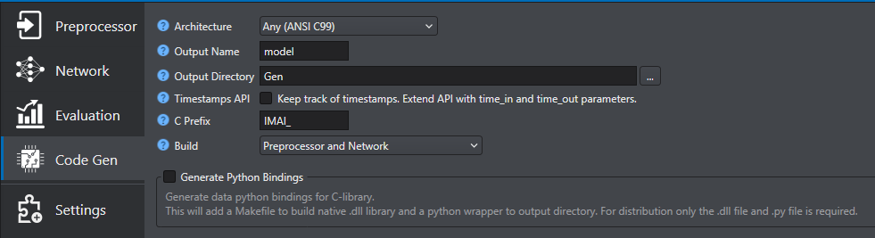

# DEEPCRAFT™ MicroPython Converter

## Overview

This utility automates the conversion of [DEEPCRAFT™ Studio](https://www.infineon.com/design-resources/embedded-software/deepcraft-edge-ai-solutions/deepcraft-studio) model exports into .mpy modules compatible with MicroPython projects. It simplifies integration of AI/ML models into MicroPython applications running on platforms like Infineon’s [PSOC™ 6](https://www.infineon.com/evaluation-board/CY8CKIT-062S2-AI).

## Getting Started

### Requirements

1. [Python](https://www.python.org/) 3.12.0 or higher and [pip](https://pip.pypa.io/en/stable/).

2. A compatible DEEPCRAFT™ model (C source files and headers) generated from [DEEPCRAFT™ Studio](https://www.infineon.com/design-resources/embedded-software/deepcraft-edge-ai-solutions/deepcraft-studio).

3. [GnuWin32 Make](https://gnuwin32.sourceforge.net/downlinks/make.php).

### Preparation

Before using the converter, you need to have a DEEPCRAFT™ model generated from DEEPCRAFT™ Studio. Follow the instructions in the [DEEPCRAFT™ Studio documentation](https://developer.imagimob.com/deepcraft-studio/model-training/generating-model) to create and export your model.

Use these settings when exporting your model from DEEPCRAFT™ Studio:


### Installation and Usage

1. Open the command line and navigate to the directory where you want to install the converter.

2. Install the model conversion script by executing the following command:
```
pip install git+https://github.com/Infineon/deepcraft-micropython-converter.git --target .
```

3. Once installed, you can run the converter using:
```
python deepcraft_micropython_converter.py
```

4. Follow the on-screen prompts to provide the path to your DEEPCRAFT™ model files and specify any additional options as needed.

### Deploying the .mpy Model

After the script successfully ran through and converted the model it will show:
```
"GEN deepcraft_model.mpy"
[INFO] Makefile executed successfully.
```
    
Now you can locate the file `deepcraft_model.mpy` in the project folder and [upload it](https://ifx-micropython.readthedocs.io/en/latest/psoc6/mpy-usage.html#the-micropython-filesystem) to your edge device running MicroPython.

### Using the Model in MicroPython

#### Importing the Model

After uploading the `.mpy` file to your MicroPython device, you can import your model by executing:
```
import deepcraft_model
```

#### Understanding Input and Output Dimensions

Use the following functions to determine the expected input and output dimensions of your model:
```
input_dim = model.get_model_input_dim()
output_dim = model.get_model_output_dim()
```

`output_dim` indicates the number of classes your model can classify, so the length of the list
```
IMAI_DATA_OUT_SYMBOLS = ['label_1', 'label_2', ..., 'label_{output_dim}']
```
must match the value returned by `get_model_output_dim()`.

> [!TIP]
> The labels of the output classes can be found in the `model.h` header file generated by DEEPCRAFT™ Studio.

`model.enqueue(data)` expects a list `data` of sensor values with a length equal to `input_dim`. Ensure that the data you provide matches this expected input dimension for successful inference.

#### Setting the Output Buffer Size
Another crucial aspect is properly setting the output buffer size for `model.dequeue(output_buffer)`.
For this, check your DEEPCRAFT™ Studio Preprocessor configuration and use the value of *Input Shape* and *Window Shape* (first element of vector) below.
The output buffer size can be calculated as:
```
output_buffer_size > window_shape * input_shape * sizeof(data_type)
```
Where `data_type` is the data type of the output buffer (usually `float` = 4 bytes).

Then, to determine the exact buffer size, round up to the nearest multiple of 2^n that is greater than the calculated size. For example, if the calculated size is 300 bytes, you would round up to 512 bytes (2^9) to ensure sufficient memory allocation for the output buffer.
```

Below is a list of supported APIs exposed by the compiled `.mpy` module. Use these functions to interact with your model instance for initialization, data input, and inference.


| Function                  | Description                                           | Input Arguments                                           | Return                                  | Sample Usage                                     |
|---------------------------|-------------------------------------------------------|------------------------------------------------------------|------------------------------------------|--------------------------------------------------|
| `DEEPCRAFT()`             | Creates an instance for your model                    | None                                                       | `deepcraft` object                       | `import deepcraft_model as m`<br>`model = m.DEEPCRAFT()` |
| `init()`                  | Initializes the model                                 | None                                                       | None                                     | `model.init()`                                   |
| `get_model_input_dim()`   | Returns expected number of sensor values per inference| None                                                       | `int`                                    | `model.get_model_input_dim()`                    |
| `get_model_output_dim()`  | Returns number of output classes                      | None                                                       | `int`                                    | `model.get_model_output_dim()`                   |
| `enqueue(data)`           | Inputs sensor data to the model                       | `<list>` of size `get_model_input_dim()`                   | `0`: Success<br> `-1`: Error          | `model.enqueue([0.0, 0.1, ...])`                 |
| `dequeue(result)`         | Outputs classification result as class probabilities  | `<list>` of size `get_model_output_dim()`  | `0`: Success<br> `-1`: Error<br> `-2`: Internal memory allocation error          | `model.dequeue([0.0, 0.0, ...])`                 |


## Other Resources 

Installation instructions and other details around DEEPCRAFT™ Studio can be found [here](https://developer.imagimob.com/deepcraft-studio).